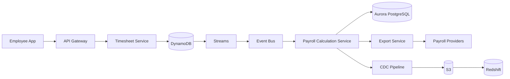

# Payroll + Compliance + Billing Platform (Behavioral Interview Deep Dive)

## 🧠 Project Summary
Designed and built a large-scale payroll and compliance system processing 500K+ timesheets weekly across 100+ jurisdictions.

Key challenges:
- Complex compliance rules per region
- Retroactive changes (rates, rules, timesheets)
- High scalability + auditability requirements
- Separation of payroll vs billing logic

---

## 🧩 High-Level Architecture

---

## 🔥 Why This Project Was Challenging

### 1. Scaling Payroll Across 100+ Jurisdictions

Each region had different:
- Overtime rules
- Holiday rules
- Tax structures
- Break/meal compliance
- Union-specific overrides

💡 Challenge:
Hardcoding rules would not scale.

✅ Solution:
- Built a **versioned rules engine**
- Rules stored as:
  - jurisdiction
  - effective date
  - worker classification
- Introduced **hierarchical overrides**
  (global → country → state → union → customer)

---

### 2. Dynamic Pay Rule Execution (Python-based rules)

Some customers required custom logic:
- Union contracts
- Special billing/pay agreements
- Custom overtime calculations

💡 Challenge:
Rules change frequently and differ per client.

✅ Solution:
- Introduced **pluggable Python rule execution engine**
- Sandboxed execution environment
- Versioned rule scripts
- Stored rule metadata + version for audit

⚠️ Key concern:
- Prevent unsafe execution
- Ensure deterministic outputs

---

### 3. Retroactive Changes (Hardest Problem)

Examples:
- Employee rate changed last month
- New compliance law applied retroactively
- Timesheet edited after payroll close

💡 Challenge:
Recalculate WITHOUT corrupting history.

✅ Solution:
- Built **Recalculation Orchestrator**
- Used:
  - effective-dated compensation
  - versioned rules
- Generated:
  - delta adjustments
  - reversal entries
- Never overwrite past results

---

### 4. Data Consistency vs Scalability

💡 Challenge:
- DynamoDB = high scale but eventual consistency
- Payroll requires strict correctness

✅ Solution:
- DynamoDB for ingestion only
- Aurora PostgreSQL for:
  - payroll results
  - transactions
  - audit snapshots

---

### 5. Payroll vs Billing Separation

💡 Challenge:
- Payroll = legal obligation
- Billing = contractual agreement

They often differ.

✅ Solution:
- Two independent pipelines:
  - Payroll pipeline (Aurora)
  - Billing pipeline (Redshift via CDC)

---

### 6. Idempotency & Duplicate Processing

💡 Challenge:
Event-driven systems can duplicate events.

✅ Solution:
- Idempotency keys:
  - employee_id + pay_period + version
- Deduplication layer
- Exactly-once behavior simulated via design

---

### 7. Auditability (Critical for Payroll)

💡 Challenge:
Need to answer:
"Why was this employee paid this amount 6 months ago?"

✅ Solution:
- Snapshot:
  - input timesheets
  - rule version
  - rate version
- Stored calculation metadata
- Deterministic recomputation

---

### 8. Performance & Scale

💡 Challenge:
- 500K+ timesheets/week
- Payroll runs across large enterprises

✅ Solution:
- Partition by:
  - employee
  - pay period
- Parallel processing workers
- Event-driven recalculation
- Async batch orchestration

---

### 9. Failure Handling

💡 Challenge:
Payroll failures are unacceptable.

✅ Solution:
- Retry queues
- Dead letter queues
- Partial batch reprocessing
- Strong observability

---

## 🧾 Key Architecture Decisions

| Problem | Decision |
|--------|--------|
| High write scale | DynamoDB |
| Payroll correctness | Aurora PostgreSQL |
| Analytics | Redshift |
| Loose coupling | Event-driven architecture |
| Compliance logic | Versioned rules engine |
| Custom logic | Python rule execution |
| Auditability | Snapshot + versioning |

---

## 🎯 Behavioral Interview Talking Points

When explaining this project:

### Emphasize:
- Scale (500K+ timesheets)
- Complexity (100+ jurisdictions)
- Tradeoffs (NoSQL vs relational)
- Real-world constraints (compliance, audits)

### Highlight leadership:
- Designed system architecture
- Made key tradeoff decisions
- Introduced rules engine abstraction

### Highlight impact:
- Reduced payroll errors
- Enabled global compliance
- Scaled to enterprise clients

---

## 🧠 2-Min Interview Summary

"I worked on a large-scale payroll platform processing hundreds of thousands of timesheets weekly across over 100 jurisdictions. The biggest challenge was handling highly dynamic compliance rules and retroactive changes while maintaining auditability. I designed an event-driven architecture where DynamoDB handled ingestion, a payroll calculation service applied versioned rules stored in Aurora PostgreSQL, and Redshift handled downstream analytics. I also introduced a pluggable Python-based rules engine for custom compliance logic. The system supported deterministic recalculation, strong audit trails, and scaled reliably across enterprise customers."

