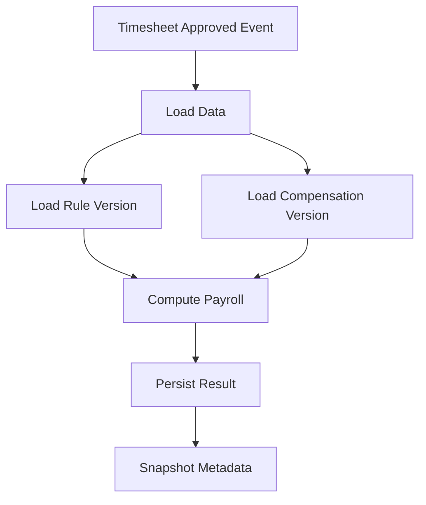
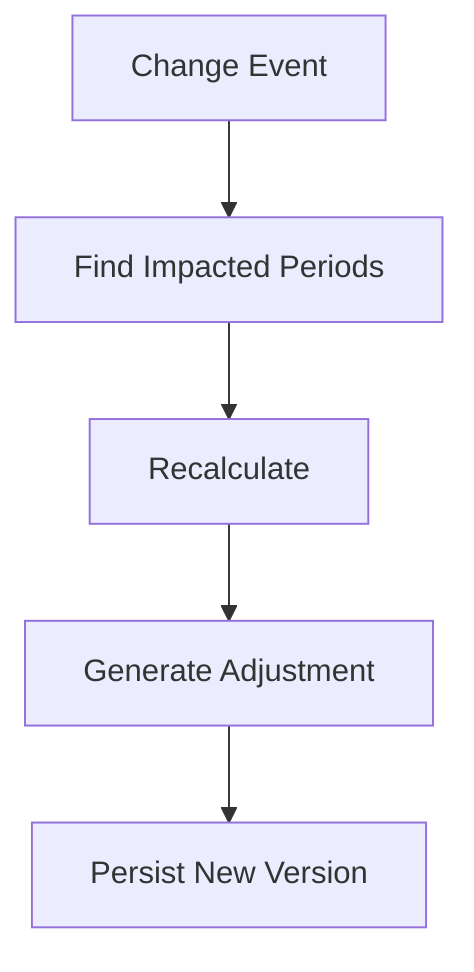

# 🎯 Payroll System – Full Behavioral + Deep Technical Story

## 🧠 30-Second Elevator Pitch

Built a scalable payroll and compliance platform processing **500K+ timesheets weekly across 100+ jurisdictions**, handling complex compliance rules, retroactive changes, and integrations with external payroll providers. Designed an **event-driven architecture with versioned rules and deterministic recomputation**, ensuring auditability and correctness.

---

# ⭐ STAR STORY (Enhanced)

## 🟡 Situation

At Replicon, we supported enterprise clients (Facebook, KPMG):
- 500K+ weekly timesheets
- 100+ jurisdictions
- Complex compliance (overtime, labor laws, unions)

Challenges:
- Hardcoded rules → not scalable
- Retroactive changes → error-prone
- Limited auditability

---

## 🔵 Task

- Design scalable payroll system
- Handle global compliance
- Support retroactive recalculation
- Ensure auditability

---

## 🟢 Action (Deep Technical)

## 1. Event-Driven Architecture
- DynamoDB → ingestion
- Streams → Event Bus
- Decoupled services:
  - Payroll
  - Billing
  - Analytics

---

## 2. Versioned Rules & Inputs (MOST IMPORTANT)

### 💡 Core Principle
Payroll must be **reproducible at any point in time**

We version **everything**:

### A. Versioned Compensation
Table: `employee_compensation_version`

| field | description |
|------|------------|
| employee_id | employee |
| rate | hourly rate |
| effective_start | start date |
| effective_end | end date |
| version_id | unique version |

👉 Never overwrite. Always insert new row.

---

### B. Versioned Pay Rules
Table: `pay_rule_version`

| field | description |
|------|------------|
| rule_id | identifier |
| jurisdiction | region |
| rule_type | overtime / holiday |
| config_json | rule config |
| effective_start | start |
| effective_end | end |
| version_id | version |

---

### C. Versioned Timesheets
- DynamoDB stores latest
- On approval → snapshot created in Aurora

Table: `timesheet_snapshot`

---

### D. Calculation Snapshot

Table: `payroll_run_snapshot`

Stores:
- timesheet snapshot reference
- rule version IDs
- compensation version IDs
- calculation version

👉 This enables:
**deterministic recomputation**

---

## ❗ Do we use materialized views?

### ❌ NOT for payroll calculation

Why:
- Rules are dynamic and procedural
- Retro changes require partial recalculation
- Hard to maintain audit trail
- Refresh lag risk

### ✅ Instead we use:

#### 1. Snapshot Tables
- Explicitly store results
- Versioned per payroll run

#### 2. Derived Tables (NOT materialized views)
- Precomputed results per batch
- Stored permanently

#### 3. Optional: Materialized views ONLY for:
- dashboards
- reporting
- aggregated analytics

---

## 3. Payroll Calculation Flow

---

## 4. Python Rule Execution Engine

Used for:
- union contracts
- custom client logic

### Design:
- sandbox execution
- versioned scripts
- deterministic outputs

---

## 5. Retroactive Recalculation

---

## 6. Scaling Strategy

- Partition by employee + pay period
- Parallel workers
- Event-driven triggers

---

## 7. Key Metrics

- 500K+ timesheets/week
- 100+ jurisdictions
- ~35% faster processing
- ~60% reduction in errors
- 5–10x reporting speed

---

# 🔥 FOLLOW-UP QUESTIONS + TRAPS

## Q: How ensure correctness?
Answer:
- versioned inputs
- snapshots
- deterministic recomputation

---

## Q: Why not materialized views?

Answer:
> Materialized views are not suitable because payroll is not just aggregation—it’s a stateful, versioned, and auditable process. Instead, we persist calculated results as versioned records and only use materialized views for reporting.

---

## 🚨 Trap: “Can we recompute everything?”

Answer:
> At scale, recomputing everything is too expensive. We detect impacted pay periods and perform targeted recalculation.

---

## 🚨 Trap: “Why version everything?”

Answer:
> Because payroll must be explainable historically. Versioning ensures we can always reconstruct the exact result at any point in time.

---

# 🎯 1-Min Answer

"I designed a payroll system processing 500K+ timesheets weekly across 100+ jurisdictions. The biggest challenge was handling dynamic compliance rules and retroactive changes. I implemented a versioned system where timesheets, compensation, and rules are all stored with effective dates. Each payroll run creates a snapshot, enabling deterministic recomputation. Instead of materialized views, we store versioned results and use event-driven recalculation. This improved correctness, reduced errors by 60%, and scaled globally."

---

# 🧠 FINAL TAKEAWAYS

- Version EVERYTHING
- Never overwrite payroll results
- Use snapshots, not materialized views
- Separate payroll from analytics
- Design for auditability first

